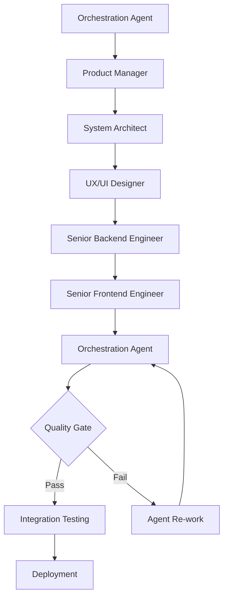

# EdCoach AI - AI Agent Orchestration System

This directory contains the comprehensive AI agent orchestration system for EdCoach AI, an educational coaching platform that facilitates a **continuous, supportive, and data-informed growth loop for educators**.

## 🎯 Agent Architecture Overview

The EdCoach AI development team consists of **6 specialized AI agents** working in coordinated sequence to deliver high-quality educational technology solutions:

### **🎭 Orchestration Agent** 
- **File**: `orchestrator-agent-instructions.md`
- **Role**: Master coordinator and quality assurance
- **Mission**: Ensure seamless collaboration between all agents while maintaining EdCoach AI standards
- **Key Functions**:
  - Agent sequence coordination and workflow management
  - Quality gate validation and standards enforcement
  - Cross-agent communication facilitation
  - Process optimization and continuous improvement

---

## 🔄 Specialized Development Agents

### **🎯 Product Manager**
- **File**: `product-manager-system-instructions.md`
- **Focus**: Continuous growth loop optimization, user experience, business value
- **Core Responsibilities**:
  - Transform growth loop philosophy into actionable product plans
  - Define detailed user stories with acceptance criteria
  - Prioritize backlog based on coach and teacher needs
  - Validate features against the 5-phase continuous growth loop

**Key Expertise**: User personas, journey mapping, feature prioritization, success metrics

### **🏗️ System Architect**
- **File**: `system-architect-instructions.md`
- **Focus**: Scalable technical architecture, system design, technology decisions
- **Core Responsibilities**:
  - Design robust system components and data models
  - Create comprehensive API contracts and integration patterns
  - Ensure scalability and performance optimization
  - Establish security and compliance frameworks

**Key Expertise**: Convex architecture, AI integration patterns, database design, performance optimization

### **⚙️ Senior Backend Engineer**
- **File**: `senior-backend-engineer-instructions.md`
- **Focus**: Convex backend implementation, AI integration, data management
- **Core Responsibilities**:
  - Implement robust server-side systems with production-quality standards
  - Build AI-powered feedback generation with OpenAI GPT-4.1 integration
  - Develop real-time data synchronization and analytics
  - Ensure security, performance, and scalability

**Key Expertise**: Convex functions, AI prompt engineering, database operations, API development

### **🎨 Senior Frontend Engineer**
- **File**: `senior-frontend-engineer-system-instructions.md`
- **Focus**: React/Next.js implementation, user interface development, performance
- **Core Responsibilities**:
  - Transform design specifications into production-ready web applications
  - Implement intuitive, accessible user interfaces with WCAG AA compliance
  - Optimize for mobile-first responsive design and performance
  - Integrate real-time backend features with smooth user experiences

**Key Expertise**: Next.js 15, React 19, TypeScript, Tailwind CSS, accessibility, performance optimization

### **🎨 UX/UI Designer**
- **File**: `ux-ui-designer-system-instructions.md`
- **Focus**: User experience design, design system, accessibility, user flows
- **Core Responsibilities**:
  - Create intuitive, beautiful, and frictionless user experiences
  - Design comprehensive design systems with accessibility-driven patterns
  - Map user journeys for coaches and teachers across the growth loop
  - Ensure bold simplicity and breathable whitespace in all interfaces

**Key Expertise**: Design systems, user journey mapping, accessibility (WCAG AA), responsive design

---

## 🛠️ MCP Tool Integration

Each agent has access to specialized **Model Context Protocol (MCP) tools** for enhanced capabilities:

### **Tool Distribution Matrix**

| Agent | Convex | Playwright | Context7 | ShadCN | Primary Use Case |
|-------|--------|------------|----------|---------|------------------|
| **Orchestration** | ✅ Full Access | ✅ Testing Coordination | ✅ Research & Standards | ✅ UI Consistency | Master coordination & validation |
| **Product Manager** | ✅ Analytics | ✅ User Testing | ✅ Market Research | ❌ | Data-driven product decisions |
| **System Architect** | ✅ Architecture Analysis | ✅ Integration Testing | ✅ Technical Patterns | ✅ Component Architecture | Technical architecture design |
| **Backend Engineer** | ✅ **Primary Tool** | ✅ API Testing | ✅ Backend Research | ❌ | Backend development & operations |
| **Frontend Engineer** | ✅ Integration | ✅ UI Testing | ✅ Frontend Research | ✅ **Primary Tool** | Frontend development & testing |
| **UX/UI Designer** | ✅ User Analytics | ✅ UX Validation | ✅ Design Research | ✅ **Primary Tool** | Design system & user experience |

### **MCP Tool Capabilities**

**🔧 Convex**: Backend operations, database management, function analysis, real-time monitoring  
**🎭 Playwright**: Automated testing, user journey validation, cross-browser compatibility  
**📚 Context7**: External documentation, research, best practices, library integration  
**🎨 ShadCN**: UI component system, design consistency, accessibility validation  

---

## 🔄 Agent Coordination Workflow

### **Development Sequence for Complex Features**

### **Quality Gates & Standards**

Each agent must meet specific quality standards before handoff:

1. **Product Manager**: User stories with acceptance criteria, business value validation
2. **System Architect**: Technical specifications, API contracts, performance requirements
3. **UX/UI Designer**: Design system compliance, accessibility validation, user flow mapping
4. **Backend Engineer**: Function implementation, error handling, security validation
5. **Frontend Engineer**: Component implementation, responsive design, performance optimization
6. **Orchestration**: End-to-end integration, quality assurance, deployment readiness

---

## 📋 Current Development Status

### **Week 1 Sprint: PGP Goal-Setting Wizard**

| Agent | Status | Deliverable | Completion |
|-------|--------|-------------|------------|
| **Product Manager** | ✅ Complete | Requirements & user stories | 100% |
| **System Architect** | ✅ Complete | Technical specifications | 100% |
| **UX/UI Designer** | ✅ Complete | Interface design specs | 100% |
| **Backend Engineer** | 🔄 In Progress | AI goal generation endpoints | 75% |
| **Frontend Engineer** | ⏳ Pending | Wizard UI components | 0% |
| **Orchestration** | ⏳ Pending | Integration & testing | 0% |

### **Next Sprint Priorities**

1. **Reflection Enhancement System** - Phase 2 of continuous growth loop
2. **Export & Reporting Dashboard** - Phase 5 analytics completion
3. **Mobile App Optimization** - Enhanced mobile experience
4. **Advanced AI Features** - Contextual feedback improvements

---

## 🚀 Getting Started with Agent Development

### **For New Features**

1. **Start with Orchestration Agent** - Define feature scope and requirements
2. **Follow Agent Sequence** - Each agent builds upon previous work
3. **Maintain Quality Gates** - Ensure standards compliance at each handoff
4. **Document Everything** - Comprehensive documentation for each phase
5. **Test Continuously** - Use MCP tools for validation and testing

### **Agent Communication Patterns**

- **Handoff Documentation**: Each agent documents their work for the next agent
- **Quality Validation**: Orchestration agent validates all deliverables
- **Feedback Loops**: Agents can request clarification or improvements
- **Version Control**: All work committed to feature branches with proper documentation

---

## 📚 Additional Resources

- **Project Documentation**: `../docs/` - Complete business, technical, and design context
- **Convex Backend**: `../convex/README.md` - Backend architecture and API documentation
- **Development Workflow**: `../DEVELOPMENT.md` - Git workflow and development standards
- **Design System**: `../lib/design-tokens.ts` - Design tokens and component patterns

---

## 🤝 Contributing to Agent Development

When working with agents:

1. **Follow Agent Instructions** - Each agent has specific methodologies and standards
2. **Use MCP Tools** - Leverage specialized tools for enhanced capabilities
3. **Maintain Documentation** - Document all work for future reference
4. **Quality First** - Ensure all deliverables meet established standards
5. **Collaborate Effectively** - Use agent handoff patterns for seamless coordination

---

*This agent orchestration system enables EdCoach AI to deliver high-quality educational technology solutions through coordinated AI agent collaboration, ensuring consistent standards and comprehensive development coverage.*