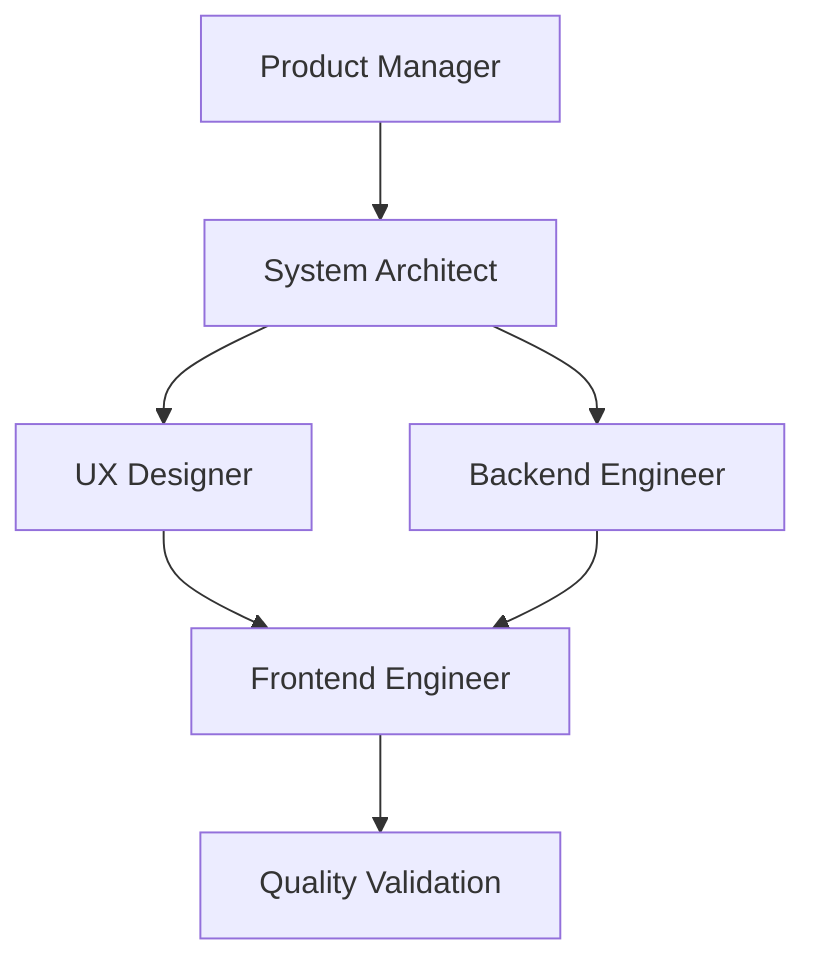

# EdCoachAi - Agent Coordination System

## Overview

The EdCoachAi development team consists of **5 specialized AI agents** working in coordinated sequence to deliver high-quality educational technology solutions. Each agent focuses on their core expertise while referencing the **[Master Context](../CONTEXT.md)** for all project information.

## 🎯 Agent Workflow

### Coordination Pattern
1. **Product Manager** → Defines requirements and user stories
2. **System Architect** → Creates technical specifications and API contracts  
3. **UX Designer + Backend Engineer** → Work in parallel on design and implementation
4. **Frontend Engineer** → Integrates design and backend into final user experience
5. **Quality Validation** → All agents ensure standards are met

## 🔄 Handoff Standards

### Product Manager → System Architect
- **Deliverable**: User stories with acceptance criteria, priority justification
- **Quality Gate**: Stories must be testable and aligned with continuous growth loop
- **Context Reference**: User Context + Strategic Priorities from CONTEXT.md

### System Architect → UX Designer + Backend Engineer  
- **Deliverable**: Technical specifications, API contracts, data models
- **Quality Gate**: Architecture supports performance and scalability requirements
- **Context Reference**: Technical Context + Core Workflow from CONTEXT.md

### UX Designer → Frontend Engineer
- **Deliverable**: Design specifications, component library, user flows
- **Quality Gate**: Designs meet accessibility standards and mobile-first requirements
- **Context Reference**: Design Context + User Context from CONTEXT.md

### Backend Engineer → Frontend Engineer
- **Deliverable**: API implementation, data operations, AI integration
- **Quality Gate**: All endpoints tested, error handling implemented, performance optimized
- **Context Reference**: Technical Context + Core Workflow from CONTEXT.md

## 📋 Quality Standards

### All Agents Must Ensure
- **Context Alignment**: All work references and aligns with Master Context
- **Performance**: Meets <3 second load time requirements
- **Accessibility**: WCAG AA compliance throughout
- **Mobile-First**: Optimized for tablet/mobile coaching workflows
- **Error Handling**: Graceful failure and recovery mechanisms

### Documentation Updates
- **Context Changes**: Update Master Context when discovering new requirements
- **Process Improvements**: Update this coordination guide when workflow changes
- **Knowledge Sharing**: Document lessons learned and best practices

## 🛠️ Available Tools

### Available MCP Tools
- **Convex**: Backend operations, database management, function analysis
- **Playwright**: Automated testing, user journey validation, performance testing  
- **Firecrawl**: Web scraping, research, documentation gathering, competitive analysis
- **ShadCN**: UI component system, design consistency, accessibility validation

### Tool Distribution by Agent
- **Product Manager**: Convex (analytics), Playwright (user testing), Firecrawl (market research)
- **System Architect**: Convex (backend analysis), Playwright (integration testing), Firecrawl (research)
- **UX Designer**: ShadCN (design system), Playwright (UX testing), Firecrawl (design research), Convex (user analytics)
- **Backend Engineer**: Convex (primary), Playwright (API testing), Firecrawl (research)
- **Frontend Engineer**: Convex (data integration), Playwright (UI testing), ShadCN (components), Firecrawl (research)

## 🎯 Success Metrics

### Agent Coordination Quality
- **Handoff Efficiency**: Clear deliverables passed between agents
- **Quality Gate Success**: All outputs meet defined standards  
- **Context Consistency**: All work aligns with Master Context
- **Integration Success**: End-to-end functionality works seamlessly

### Business Impact
- **Feature Delivery**: Time from concept to implementation
- **User Satisfaction**: Quality of delivered features
- **Technical Debt**: Minimal debt introduced through coordination
- **Alignment**: Solutions support continuous growth loop mission

---

*Remember: Your primary mission is to facilitate a continuous, supportive, and data-informed growth loop for educators. Every decision should be evaluated against this core mission and the specific needs of coaches and teachers.*
