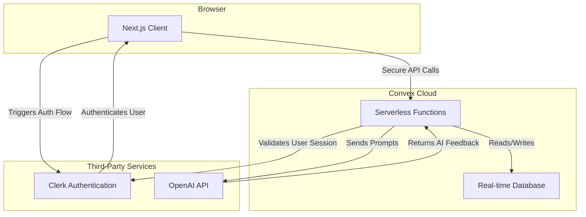

# EdCoach AI - Architecture

**Last Updated:** September 4, 2025
**Document Owner:** System Architect
**Reviewers:** Product Manager, Senior Backend Engineer, Senior Frontend Engineer

*This document is structured according to the principles outlined in the [Core Documentation for Project Success](./foundational-documentation.md).*

## 1. Overview

This document outlines the system architecture for EdCoach AI. The application is a modern web application designed to be scalable, maintainable, and secure, leveraging a serverless backend and a reactive frontend to provide a seamless user experience for instructional coaches and teachers.

## 2. Technology Stack

The application is built using a modern, TypeScript-first technology stack.

*   **Framework:** [Next.js](https://nextjs.org/) (App Router)
*   **Language:** [TypeScript](https://www.typescriptlang.org/)
*   **Backend & Database:** [Convex](https://www.convex.dev/) (Full-stack serverless platform with a real-time database)
*   **Authentication:** [Clerk](https://clerk.com/)
*   **Styling:** [Tailwind CSS](https://tailwindcss.com/)
*   **UI Components:** [shadcn/ui](https://ui.shadcn.com/)
*   **AI Integration:** OpenAI GPT-4 for feedback generation
*   **Deployment:** Vercel (Frontend), Convex Cloud (Backend)

## 3. High-Level System Design

The architecture is composed of three main parts: the client (Next.js web app), the backend (Convex), and third-party services (Clerk for auth, OpenAI for AI).



## 4. Major Components & Interactions

### 4.1. Next.js Frontend
*   **Responsibility:** Renders the user interface, handles user interactions, and communicates with the Convex backend.
*   **Structure:** Utilizes the Next.js App Router for route and layout management. Components are organized by feature and reusability.
*   **State Management:** State is primarily managed via Convex's real-time queries, which automatically update the UI when data changes in the database.

### 4.2. Convex Backend
*   **Responsibility:** Manages all business logic, data storage, and communication with third-party APIs.
*   **Structure:** Logic is organized into serverless functions (queries, mutations, and actions) within the `/convex` directory. The database schema is defined in `convex/schema.ts`.
*   **Key Functions:**
    *   **Mutations:** Handle data creation and updates (e.g., saving a walkthrough).
    *   **Queries:** Handle data retrieval (e.g., fetching a teacher's growth journal).
    *   **Actions:** Handle side effects and third-party API calls (e.g., calling the OpenAI API to generate feedback).

### 4.3. Clerk Authentication
*   **Responsibility:** Manages user identity, sign-up, sign-in, and session management.
*   **Integration:** Clerk is integrated with Convex to secure backend functions, ensuring that only authenticated users can access or modify their data. The frontend uses Clerk's React components for UI elements.

## 5. Data Flow Example: AI-Enhanced Walkthrough

1.  **Coach Initiates:** The Coach fills out the walkthrough form in the Next.js client.
2.  **Client Calls Mutation:** The client calls a Convex `mutation` to save the initial walkthrough evidence.
3.  **Mutation Triggers Action:** The `mutation` then schedules a Convex `action` to generate the AI feedback.
4.  **Action Calls OpenAI:** The `action` formats a prompt containing the PGP goal, rubric indicators, and observation evidence, then calls the OpenAI API.
5.  **Action Updates Data:** OpenAI returns the generated feedback. The `action` calls another `mutation` to save this feedback to the walkthrough document in the Convex database.
6.  **UI Updates in Real-Time:** Because the client has a real-time subscription to the walkthrough data, the UI automatically updates to display the AI-generated feedback as soon as it's saved.

## 6. Data Contracts

The single source of truth for all data models is the `convex/schema.ts` file. All communication between the client and server should adhere to these defined structures.

Below is the type definition for a core entity, the `Walkthrough`, as derived from the schema. Note that the `Id` type would be imported from `"convex/values"`.

```typescript
interface Walkthrough {
  _id: Id<"walkthroughs">;
  _creationTime: number;
  coachId: string;
  teacherId: Id<"users">;
  reinforcement: string;
  refinement: string;
  reinforcementEvidence: string;
  refinementEvidence: string;
  rawAiFeedback?: string;
  isFinalized: boolean;
  pgpGoal?: string;
  reflection?: string;
  nextSteps?: string;
}
```

## 7. External Integration Strategy

To support the P1 priority of "Integration Readiness" for external systems like a Student Information System (SIS) or Learning Management System (LMS), a versioned, secure API will be created.

*   **Technology:** Convex HTTP Actions will be used to expose API endpoints.
*   **Authentication:** Endpoints will be secured using API keys or another token-based authentication method managed within Convex.
*   **Versioning:** The API will be versioned (e.g., `/api/v1/...`) to ensure non-breaking changes for consumers.

## 8. Configuration & Deployment

*   **Environment Variables:** All secrets and environment-specific configurations (e.g., Clerk and OpenAI API keys) are managed through the built-in environment variable systems in Vercel (for the frontend) and Convex (for the backend).
*   **Promotion Process:** Configurations are managed separately for development and production environments. Any changes must be applied and tested in the development environment before being manually promoted to production.
