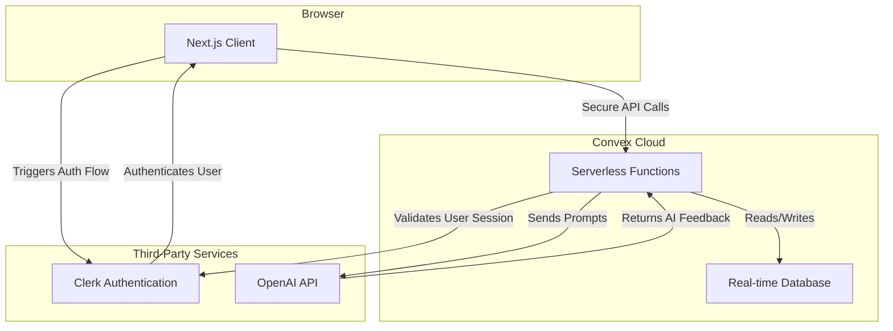

# EdCoach AI - Complete Technical Context

**Last Updated:** September 5, 2025
**Document Owner:** System Architect
**Reviewers:** Product Manager, Senior Backend Engineer, Senior Frontend Engineer

*This document is structured according to the principles outlined in the [Core Documentation for Project Success](./foundational-documentation.md).*

---

## Table of Contents

1. [Foundational Documentation Principles](#foundational-documentation-principles)
2. [System Architecture](#system-architecture)
3. [Code Structure & Organization](#code-structure--organization)
4. [Error Handling & Performance Guidelines](#error-handling--performance-guidelines)
5. [Implementation Standards](#implementation-standards)

---

## Foundational Documentation Principles

### Core Documentation for Project Success

This section outlines the essential documentation framework that ensures project success through comprehensive planning and clear communication.

#### 1. Project Vision & Goal Alignment Document

**Purpose:** To clearly articulate the overarching purpose, goals, and guiding philosophy of your application. This is crucial for re-confirming alignment with original objectives and ensuring the project serves its overarching purpose.

**Content:**
* **Guiding Philosophy:** For example, the EdCoachAI project's guiding philosophy is "The Continuous Growth Loop".
* **Initial Vision & Objectives:** Explicitly state the original goals and outcomes your project aims to achieve.
* **Transformation Focus:** Outline the "new version of themselves" users are buying, rather than just a list of features, and how your product helps them unlock it.

**Impact:** Serves as the "North Star" for all development decisions, ensuring everyone is building towards the same outcome.

#### 2. User Persona / Customer Avatar Document

**Purpose:** To provide a deep, detailed understanding of your ideal user, which is necessary to effectively bridge the gap between their current state and desired transformation.

**Content:**
* **Problem-aware Customer Avatar:** Go beyond basic demographics to include psychographic information such as personality traits, values, frustrations, complaints about existing solutions, dominant emotions, beliefs, decision triggers, and primary wants.
* **Buyer Awareness Levels:** Document the different levels of awareness your target users have about the problem your app solves, as messaging must be tailored to these stages.
* **Buyer Sophistication Levels:** Detail how the sophistication of your target market has evolved with existing solutions, informing how your messaging should adapt.

**Impact:** Refines who you are building for and helps construct effective user experiences and marketing messages.

#### 3. Architecture Documentation

**Purpose:** To synthesize architectural decisions into a comprehensive description, serving as a definitive guide for implementation and testing.

**Content:** High-level system design, technology stack, major components and their interactions, data flow, and infrastructure considerations.

#### 4. Code Structure & Organization Guidelines

**Purpose:** To establish consistent patterns for how code is organized within the codebase, crucial for maintainability and collaboration.

**Content:**
* **Project Context (`gemini.md`):** A document that helps AI (and humans) understand "all of what's going on" in your project folder, which can be manually enhanced for better AI understanding.
* **File Naming Conventions:** Standardize between PascalCase, kebab-case, etc.
* **Component Consolidation Opportunities:** Identify and document plans to merge duplicate functionality.
* **Rules for AI Agent Behavior:** Specific rules (like `.cursorrules`) that guide agent behavior for future projects or specific files, ensuring consistent AI-assisted development.

#### 5. Component Library / Specifications

**Purpose:** To document all reusable UI components, their properties, usage, and states, ensuring consistency and accelerating development.

**Content:**
* **Storybook or Similar Documentation:** A dedicated platform for showcasing and documenting components.
* **Unified Loading Component System:** Specifications for how loading states are handled across the application, including patterns (skeleton loaders vs. spinners) and durations.
* **Badge/Tag Component System:** Define semantic variants for colors instead of hardcoded values, and specify usage patterns.

#### 6. Design Guidelines / Profile

**Purpose:** To standardize visual elements and interaction patterns, ensuring a professional, appealing, and consistent user experience.

**Content:**
* **Typography:** Better pairings of fonts and details about font usage.
* **Color Grading & Atmospheric Effects:** Mesh gradients and color overlays.
* **Micro-animations & Hover States:** Guidelines for adding subtle interactivity, avoiding exaggerated effects.
* **Shadows, Glows & Depth Effects:** How to create visual depth on the page through styling.
* **Responsive Grid Patterns:** Standardized utilities and documentation for consistent layout across devices.
* **Form Patterns:** Consistent layouts, validation error displays, and button placements.
* **Icon Usage Standardization:** Consistent sizing and semantic color classes for icons.
* **General Visual Polish:** Documenting "finishing touches" that make the application feel premium and trustworthy.

#### 7. User Journey & Workflow Documentation

**Purpose:** To comprehensively describe the core user journeys, detailing exactly what each user sees and does at every step.

**Content:**
* **Golden Path:** Trace the entire journey from a coach's first login to a teacher's moment of reflection, detailing phases like "Set Goal → Capture Evidence → Generate Feedback → Reflect → Monitor Growth".
* **Detailed Workflow Descriptions:** For each phase, specify entry points, actions, system responses (e.g., AI engine processes), and outcomes for both coaches and teachers.
* **Interface Responses, Validation, Microcopy:** Document these elements for every feature, ensuring a comprehensive and thoughtful design.

#### 8. Feature Documentation

**Purpose:** To provide robust, detailed descriptions of each feature's functionality and requirements.

**Content:** Detailed explanations of features, their intended behavior, and any underlying logic. This can be pulled from a repository using tools like GitHub MCP.

#### 9. UI/UX Issues Backlog

**Purpose:** While you aim to complete tasks from it, having a well-structured backlog document is essential for tracking outstanding UI/UX work and guiding future development cycles.

**Content:** Prioritized lists of high, medium, and low-priority issues, technical debt (accessibility, performance, error handling), and cleanup tasks, including estimated effort and impact.

#### 10. Accessibility Guide

**Purpose:** To ensure the application meets accessibility standards and provides an inclusive experience for all users.

**Content:** WCAG compliance checklists, guidelines for focus management, keyboard navigation, screen reader support (e.g., ARIA labels), and color contrast standards.

#### 11. Error Handling & Performance Guidelines

**Purpose:** To standardize how errors are displayed and handled across the application and to outline performance optimization strategies.

**Content:** Guidelines for gracefully handling network failures, consistent display of form validation errors, implementation of error boundaries, and strategies for bundle size reduction, dashboard loading, and offline support.

By creating these comprehensive documentation files, you will establish clear patterns in your codebase, reinforce alignment with your app's core vision, and build a strong foundation for both tackling current backlog items and guiding all future development.

---

## System Architecture

### Overview

This document outlines the system architecture for EdCoach AI. The application is a modern web application designed to be scalable, maintainable, and secure, leveraging a serverless backend and a reactive frontend to provide a seamless user experience for instructional coaches and teachers.

### Technology Stack

The application is built using a modern, TypeScript-first technology stack.

*   **Framework:** [Next.js](https://nextjs.org/) (App Router)
*   **Language:** [TypeScript](https://www.typescriptlang.org/)
*   **Backend & Database:** [Convex](https://www.convex.dev/) (Full-stack serverless platform with a real-time database)
*   **Authentication:** [Clerk](https://clerk.com/)
*   **Styling:** [Tailwind CSS](https://tailwindcss.com/)
*   **UI Components:** [shadcn/ui](https://ui.shadcn.com/)
*   **AI Integration:** OpenAI GPT-4 for feedback generation
*   **Deployment:** Vercel (Frontend), Convex Cloud (Backend)

### High-Level System Design

The architecture is composed of three main parts: the client (Next.js web app), the backend (Convex), and third-party services (Clerk for auth, OpenAI for AI).



### Major Components & Interactions

#### Next.js Frontend
*   **Responsibility:** Renders the user interface, handles user interactions, and communicates with the Convex backend.
*   **Structure:** Utilizes the Next.js App Router for route and layout management. Components are organized by feature and reusability.
*   **State Management:** State is primarily managed via Convex's real-time queries, which automatically update the UI when data changes in the database.

#### Convex Backend
*   **Responsibility:** Manages all business logic, data storage, and communication with third-party APIs.
*   **Structure:** Logic is organized into serverless functions (queries, mutations, and actions) within the `/convex` directory. The database schema is defined in `convex/schema.ts`.
*   **Key Functions:**
    *   **Mutations:** Handle data creation and updates (e.g., saving a walkthrough).
    *   **Queries:** Handle data retrieval (e.g., fetching a teacher's growth journal).
    *   **Actions:** Handle side effects and third-party API calls (e.g., calling the OpenAI API to generate feedback).

#### Clerk Authentication
*   **Responsibility:** Manages user identity, sign-up, sign-in, and session management.
*   **Integration:** Clerk is integrated with Convex to secure backend functions, ensuring that only authenticated users can access or modify their data. The frontend uses Clerk's React components for UI elements.

### Data Flow Example: AI-Enhanced Walkthrough

1.  **Coach Initiates:** The Coach fills out the walkthrough form in the Next.js client.
2.  **Client Calls Mutation:** The client calls a Convex `mutation` to save the initial walkthrough evidence.
3.  **Mutation Triggers Action:** The `mutation` then schedules a Convex `action` to generate the AI feedback.
4.  **Action Calls OpenAI:** The `action` formats a prompt containing the PGP goal, rubric indicators, and observation evidence, then calls the OpenAI API.
5.  **Action Updates Data:** OpenAI returns the generated feedback. The `action` calls another `mutation` to save this feedback to the walkthrough document in the Convex database.
6.  **UI Updates in Real-Time:** Because the client has a real-time subscription to the walkthrough data, the UI automatically updates to display the AI-generated feedback as soon as it's saved.

### Data Contracts

The single source of truth for all data models is the `convex/schema.ts` file. All communication between the client and server should adhere to these defined structures.

Below is the type definition for a core entity, the `Walkthrough`, as derived from the schema. Note that the `Id` type would be imported from `"convex/values"`.

```typescript
interface Walkthrough {
  _id: Id<"walkthroughs">;
  _creationTime: number;
  coachId: string;
  teacherId: Id<"users">;
  reinforcement: string;
  refinement: string;
  reinforcementEvidence: string;
  refinementEvidence: string;
  rawAiFeedback?: string;
  isFinalized: boolean;
  pgpGoal?: string;
  reflection?: string;
  nextSteps?: string;
}
```

### External Integration Strategy

To support the P1 priority of "Integration Readiness" for external systems like a Student Information System (SIS) or Learning Management System (LMS), a versioned, secure API will be created.

*   **Technology:** Convex HTTP Actions will be used to expose API endpoints.
*   **Authentication:** Endpoints will be secured using API keys or another token-based authentication method managed within Convex.
*   **Versioning:** The API will be versioned (e.g., `/api/v1/...`) to ensure non-breaking changes for consumers.

### Configuration & Deployment

*   **Environment Variables:** All secrets and environment-specific configurations (e.g., Clerk and OpenAI API keys) are managed through the built-in environment variable systems in Vercel (for the frontend) and Convex (for the backend).
*   **Promotion Process:** Configurations are managed separately for development and production environments. Any changes must be applied and tested in the development environment before being manually promoted to production.

### Performance Monitoring & Scaling

#### Performance Monitoring
*   **Metrics Tracking:** Monitor key performance indicators including response times, error rates, and user engagement metrics.
*   **Real-time Alerts:** Set up automated alerts for performance degradation or system failures.
*   **User Experience Metrics:** Track Core Web Vitals and user satisfaction scores.

#### Scaling Considerations
*   **Database Scaling:** Convex automatically handles database scaling, but monitor query performance and optimize as needed.
*   **API Rate Limits:** Implement rate limiting for external API calls (OpenAI, Clerk) to manage costs and ensure reliability.
*   **Caching Strategy:** Use Convex's built-in caching for frequently accessed data and implement client-side caching for static content.
*   **Load Testing:** Regular load testing to identify bottlenecks and scaling requirements.

#### High-Traffic Patterns
*   **Concurrent Users:** Monitor concurrent user limits and implement queuing for AI generation requests.
*   **Data Archiving:** Implement data archiving strategies for old walkthroughs and reflections.
*   **CDN Integration:** Use Vercel's global CDN for static assets and consider edge functions for dynamic content.

---

## Code Structure & Organization

### Overview

This document establishes the guidelines for code structure, file organization, and naming conventions within the EdCoach AI codebase. Adhering to these standards is crucial for maintainability, collaboration, and ensuring that AI development assistants can work effectively within the project.

### Directory Structure

The project follows a hybrid structure based on Next.js and Convex conventions.

*   `/app`: Contains all frontend routes, pages, and layouts, following the Next.js App Router paradigm.
    *   `/app/(dashboard)`: Group for all authenticated user dashboard routes.
    *   `/app/(marketing)`: Group for all public-facing marketing pages.
    *   `/app/api`: For any Next.js API routes (server-side handlers).
*   `/components`: Home for all shared, reusable React components.
    *   `/components/ui`: Contains base UI components from shadcn/ui.
    *   `/components/common`: For general-purpose components used across the app (e.g., `Logo`).
    *   `/components/layout`: For major layout components like headers and sidebars.
*   `/convex`: Contains all backend logic, including database schema, functions, and authentication configuration.
*   `/hooks`: For shared React hooks (e.g., `use-mobile`).
*   `/lib`: For utility functions and shared libraries (e.g., `utils.ts`).
*   `/public`: For static assets like images and fonts.
*   `/docs`: All project documentation.

### File Naming Conventions

To maintain consistency, please follow these naming conventions:

*   **Components & Hooks:** `PascalCase.tsx` (e.g., `WalkthroughCard.tsx`, `usePlanDetection.ts`).
*   **Pages & Layouts:** `lowercase.tsx` (e.g., `page.tsx`, `layout.tsx`).
*   **Backend Functions (Convex):** `camelCase.ts` (e.g., `aiFeedback.ts`, `walkthroughs.ts`).
*   **Utility & Library Files:** `camelCase.ts` or `PascalCase.ts` (e.g., `utils.ts`, `ErrorHandler.ts`).
*   **Styling Files:** `kebab-case.css` (e.g., `global.css`).

### Project Context for AI (`gemini.md`)

As recommended in our foundational documentation, a `gemini.md` (or a similar AI context file) should be maintained at the root of the project.

*   **Purpose:** This file provides high-level context about the project's goals, tech stack, and architectural patterns to AI assistants. This improves the quality and relevance of AI-generated code and suggestions.
*   **Content:** It should include a summary of the project vision, a list of key technologies, and any non-obvious patterns or rules for the AI to follow.

### Future Considerations

*   **Component Consolidation:** As the application grows, we should regularly audit the `/components` directory to identify opportunities to merge duplicate or similar components into a single, more robust component.
*   **AI Agent Rules (`.cursorrules`):** For more granular control over AI behavior in specific directories, `.cursorrules` files can be implemented. This could be useful in the `/convex` directory to enforce specific patterns for database queries or mutations.

---

## Error Handling & Performance Guidelines

### Overview

This document provides guidelines for handling errors and maintaining application performance. The goal is to ensure a robust, resilient, and fast user experience, where failures are handled gracefully and the application feels responsive.

### Error Handling Strategy

#### Backend Error Handling (Convex)

*   **Principle:** Failures in Convex actions, especially those involving third-party APIs like OpenAI, must be caught and handled gracefully. An API failure should never result in a crashed process or lost data.
*   **Pattern for Actions with API Calls:**
    1.  Wrap all third-party API calls in a `try...catch` block.
    2.  In the `catch` block, log the specific error for debugging purposes.
    3.  The action should `throw` a new, structured error (e.g., `new Error("AI_GENERATION_FAILED")`) that the client can interpret. Do not expose raw API error messages to the client.
    4.  The calling mutation on the client-side should also wrap its call in a `try...catch` block to handle the thrown error.

#### Frontend Error Display

*   **Principle:** User-facing errors should be clear, concise, and non-technical. Users should be informed that something went wrong without being overwhelmed by technical jargon.
*   **Pattern for Displaying Errors:**
    1.  **Toasts for Actionable Errors:** When a user action fails (e.g., saving a form, generating feedback), a "Toast" notification should be used to display the error.
    2.  **Component:** Use the `useToast` hook and `Toast` component from the component library.
    3.  **Content:** The toast should have a `variant` of `destructive` and contain a simple, helpful message (e.g., "Failed to generate feedback. Please try again.").

#### Error Boundaries
*   **Implementation:** React Error Boundaries should be implemented at key layout points (e.g., in `layout.tsx` files) to catch and handle rendering errors within a specific part of the UI, preventing a full-page crash.

### Performance Guidelines

#### Dashboard Loading
*   **Strategy:** To ensure dashboards load quickly, implement skeleton loaders (`components/ui/skeleton.tsx`) for all primary data-driven components. This provides an immediate visual response while data is being fetched from Convex in the background.

#### Bundle Size Reduction
*   **Strategy:** Regularly analyze the application's bundle size using tools like the Next.js Build Analyzer. Proactively identify and replace heavy libraries with lighter alternatives where possible. Implement code-splitting for large components that are not required on the initial page load.

---

## Implementation Standards

### Code Review Checklist

#### Component Review Checklist
- [ ] **TypeScript Compliance:** All components use proper TypeScript types
- [ ] **Accessibility:** Components meet WCAG AA standards with proper ARIA labels
- [ ] **Responsive Design:** Components work across all breakpoints
- [ ] **Error Handling:** Components handle error states gracefully
- [ ] **Performance:** Components use appropriate React patterns (memo, useMemo, useCallback)
- [ ] **Testing:** Components have corresponding test files

#### Backend Function Review Checklist
- [ ] **Input Validation:** All inputs are properly validated using Convex validators
- [ ] **Error Handling:** Functions handle errors gracefully with appropriate logging
- [ ] **Security:** Functions implement proper authentication and authorization
- [ ] **Performance:** Functions are optimized for database queries and external API calls
- [ ] **Documentation:** Functions have clear JSDoc comments explaining purpose and parameters

### Testing Patterns
- **Unit Tests:** Test individual functions and components in isolation
- **Integration Tests:** Test interactions between components and backend functions
- **E2E Tests:** Test complete user workflows using Playwright or similar tools
- **Performance Tests:** Test application performance under various load conditions

### Development Workflow

#### Git Workflow
1. **Feature Branches:** Create feature branches from `main` for new features
2. **Commit Messages:** Use conventional commit format (feat:, fix:, docs:, etc.)
3. **Pull Requests:** All changes must go through pull request review
4. **Testing:** Ensure all tests pass before merging

#### Code Quality Standards
1. **TypeScript:** Strict mode enabled, no `any` types allowed
2. **ESLint:** Follow project ESLint configuration
3. **Prettier:** Use Prettier for code formatting
4. **Husky:** Pre-commit hooks for linting and formatting

#### Documentation Standards
1. **JSDoc:** All public functions and components must have JSDoc comments
2. **README Updates:** Update relevant README files for significant changes
3. **API Documentation:** Document all public APIs and data contracts
4. **Changelog:** Maintain a changelog for significant releases

---

## Version History
- **v1.0** (September 2025) - Initial comprehensive technical context documentation
- **Next Review:** November 2025 (after architecture review)

---

*This document is structured according to the principles outlined in the [Core Documentation for Project Success](./foundational-documentation.md).*
