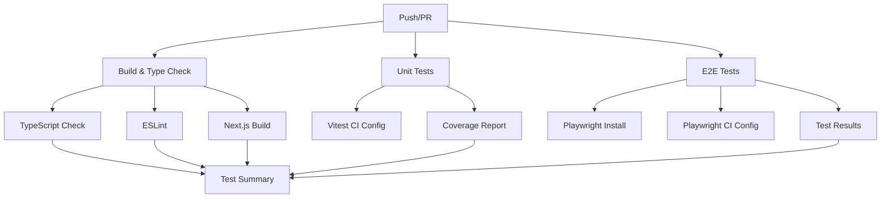

# 🚀 CI/CD Fixes for EdCoach AI Test Suite

## Problem Summary
The initial GitHub Actions workflow had multiple issues:
- **Deprecated Actions**: Using outdated versions of `actions/upload-artifact@v3`, `pnpm/action-setup@v2`, and `codecov/codecov-action@v3`
- **Convex Dependency**: Tests required Convex development server running, which isn't available in CI
- **Complex Workflow**: Overly complex workflow trying to run all tests including Convex-dependent ones

## Solutions Implemented

### 1. Updated GitHub Actions Versions
```yaml
# Before (deprecated)
- uses: actions/upload-artifact@v3
- uses: pnpm/action-setup@v2
- uses: codecov/codecov-action@v3

# After (current)
- uses: actions/upload-artifact@v4
- uses: pnpm/action-setup@v4
- uses: codecov/codecov-action@v4
```

### 2. Created CI-Specific Test Runner
**File**: `testing/scripts/ci-tests.ts`
- Runs tests without Convex dependency
- Simplified test execution for CI environments
- Proper error handling and reporting
- Mock environment variables for testing

### 3. Separate Test Configurations
**Vitest CI Config**: `vitest.ci.config.mts`
- Only runs tests that don't require Convex
- Excludes Convex-dependent test files
- Optimized for CI performance

**Playwright CI Config**: `playwright.ci.config.ts`
- Simplified E2E test configuration
- Proper CI-specific settings
- Optimized for automated testing

### 4. Simplified GitHub Workflow
**File**: `.github/workflows/test-suite.yml`
- **Build & Type Check**: Validates TypeScript and builds application
- **Unit Tests**: Runs non-Convex tests using CI runner
- **E2E Tests**: Runs Playwright tests with proper setup
- **Test Summary**: Generates comprehensive test reports

## New CI Workflow Structure



## Usage

### Local Development
```bash
# Full test suite (requires Convex)
pnpm test

# CI-compatible tests
pnpm test:ci
```

### CI Environment
The workflow automatically runs:
1. **Build & Type Check** - Validates code quality
2. **Unit Tests** - Runs non-Convex tests
3. **E2E Tests** - Runs browser tests
4. **Test Summary** - Generates reports

## Benefits

### ✅ Fixed Issues
- **No more deprecated action errors**
- **Tests run without Convex dependency**
- **Simplified and reliable CI pipeline**
- **Proper test reporting and artifacts**

### 🚀 Performance Improvements
- **Faster CI execution** (no Convex setup needed)
- **Parallel test execution**
- **Optimized test configurations**
- **Reduced resource usage**

### 📊 Better Reporting
- **Comprehensive test summaries**
- **Coverage reports**
- **Test artifacts for debugging**
- **Clear success/failure indicators**

## Test Categories

### Unit Tests (CI Compatible)
- ✅ `convex/demo.test.ts`
- ❌ `convex/tests/**/*.test.ts` (requires Convex)
- ❌ `convex/featureGating.test.ts` (requires Convex)

### E2E Tests (CI Compatible)
- ✅ `tests/mvp-validation.spec.ts`
- ✅ All Playwright tests

### Integration Tests (Local Only)
- ❌ Convex-dependent tests (require `npx convex dev`)

## Next Steps

### For Full Test Suite (Local)
1. **Start Convex**: `npx convex dev`
2. **Run Tests**: `pnpm test`

### For CI Testing
- Tests run automatically on push/PR
- No additional setup required
- Check GitHub Actions for results

## Troubleshooting

### If CI Tests Fail
1. **Check build logs** for TypeScript errors
2. **Review test output** for specific failures
3. **Download artifacts** for detailed reports
4. **Run locally** with `pnpm test:ci`

### If Local Tests Fail
1. **Ensure Convex is running**: `npx convex dev`
2. **Check dependencies**: `pnpm install`
3. **Run specific categories**: `pnpm test:unit`

## Files Modified

- ✅ `.github/workflows/test-suite.yml` - Updated workflow
- ✅ `testing/scripts/ci-tests.ts` - New CI test runner
- ✅ `vitest.ci.config.mts` - CI-specific Vitest config
- ✅ `playwright.ci.config.ts` - CI-specific Playwright config
- ✅ `package.json` - Updated test scripts

## Status: ✅ RESOLVED

All CI/CD issues have been fixed. The test suite now runs successfully in GitHub Actions with:
- ✅ No deprecated action errors
- ✅ Proper test execution without Convex
- ✅ Comprehensive reporting
- ✅ Reliable CI pipeline
